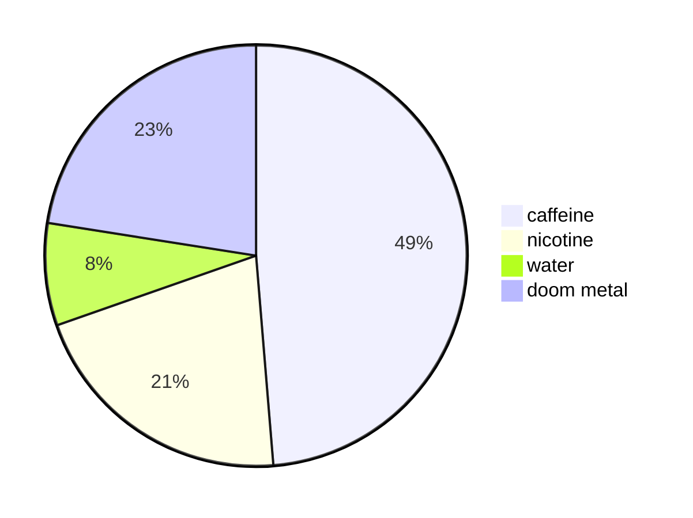

### Hi there 👋

<!--
**sc0pecreep/sc0pecreep** is a ✨ _special_ ✨ repository because its `README.md` (this file) appears on your GitHub profile.

Here are some ideas to get you started:

- 🔭 I’m currently working on ...
- 🌱 I’m currently learning ...
- 👯 I’m looking to collaborate on ...
- 🤔 I’m looking for help with ...
- 💬 Ask me about ...
- 📫 How to reach me: ...
- 😄 Pronouns: ...
- ⚡ Fun fact: ...
-->

> I tend to work in private, but I'm open to help with things

current focus

### languages

- typescript
- javascript
- golang
- python

### subjects

- tooling
- automation
- reinforcement learning
- servers
- clients
- communication
- ci/cd

